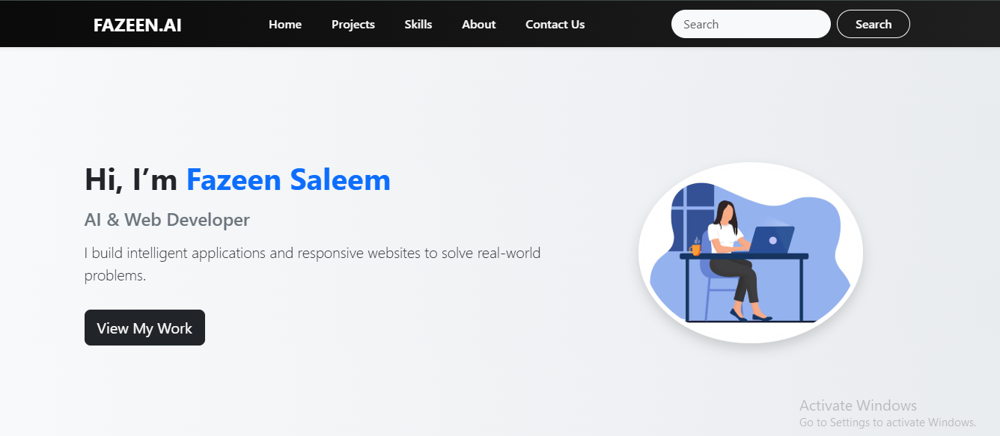
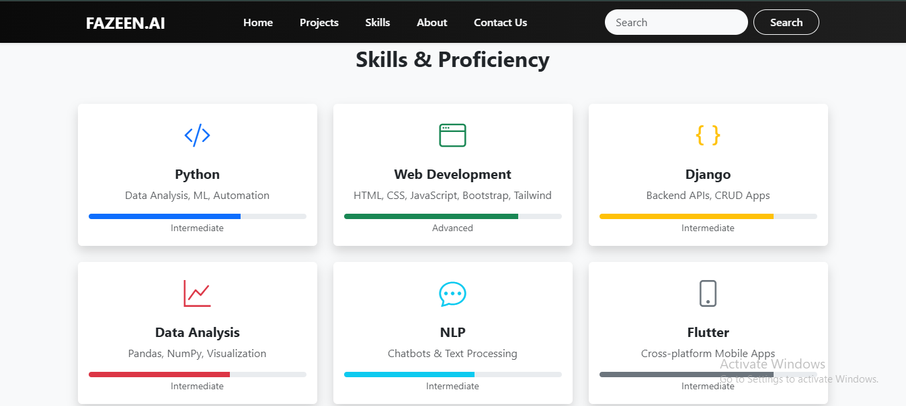
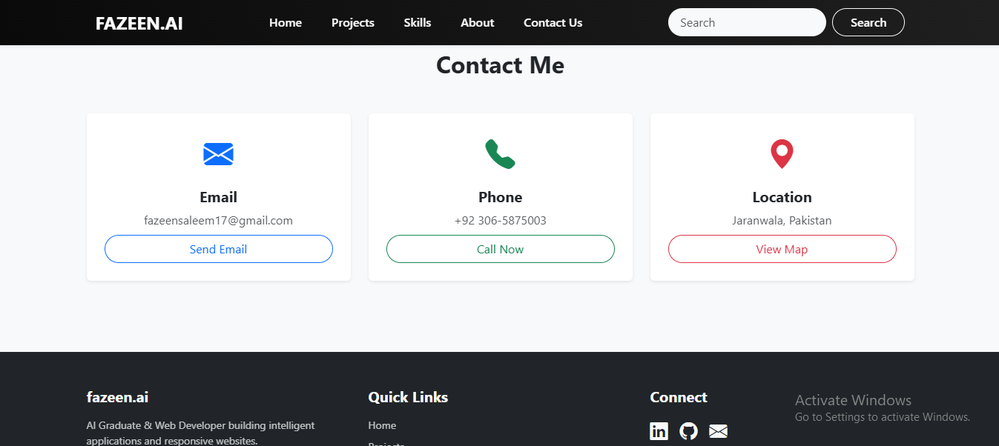

<!-- Project Icon -->
<p align="center">
  
</p>

<h1 align="center">🚀 Fazeen Portfolio Website</h1>

<p align="center">
A <b>modern, responsive personal portfolio</b> showcasing my skills, projects, and contact details.<br>
Built with <b>HTML</b>, <b>CSS</b>, and <b>Bootstrap 5</b>, this portfolio highlights my expertise in <b>AI</b>, <b>Web Development</b>, and <b>Data Science</b>.
</p>

---

## ✨ Features
✅ Fully responsive design (desktop, tablet & mobile)  
✅ Smooth animations & hover effects  
✅ Clean, professional UI using Bootstrap 5  
✅ Downloadable CV button  
✅ Sections: **Home**, **Projects**, **Skills**, **About**, **Contact Us**

---

## 🖼️ Screenshots  

### 🏠 Home  
  

### 💼 Projects  
  

### 🛠️ Skills  
  

### 👤 About  
  

### 📩 Contact Us  
  

---

## 🛠️ Tech Stack
- **Frontend:** HTML5, CSS3, Bootstrap 5  
- **Icons:** Bootstrap Icons  
- **Hosting:** GitHub Pages  

---

## 🌐 Live Demo
🔗 **[View Portfolio](https://fazeensaleem17-byte.github.io/fazeen-portfolio/)**
---

## ⚡ Getting Started

### 1️⃣ Clone the Repository
```bash
git clone https://github.com/fazeensaleem17-byte/fazeen-portfolio.git
```
### 2️⃣ Navigate to Project
```bash
cd fazeen-portfolio
```

### 3️⃣ Open in Browser
Simply open **`index.html`** in your browser.

---

### 👨‍💻 Author
**Fazeen Saleem**  
🎓 *AI Graduate* | 💻 *Web & AI Developer*  

📧 **[fazeensaleem17@gmail.com](mailto:fazeensaleem17@gmail.com)**  

🔗 **[LinkedIn](https://www.linkedin.com/in/fazeen-saleem-53b00922b/)** | **[GitHub](https://github.com/fazeensaleem17-byte)**

---

⭐ If you like this project, please give it a **star** on GitHub!
